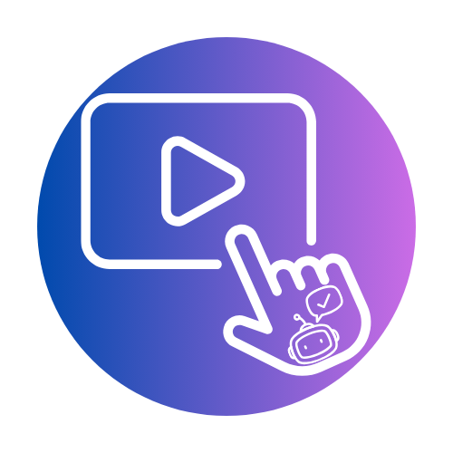

<p align="center">
  
</p>

<h1 align="center">DescriptorPro</h1>

<p align="center"><strong>Captions, audio description, and image description — drafted on your own computer, reviewed by a person.</strong><br>
By <a href="https://techinclusion.pro">Tech Inclusion Pro</a></p>

---

DescriptorPro is a local-first desktop tool that produces three kinds of access for media. All AI runs on your computer; nothing leaves it unless you explicitly turn on a cloud option with your own key.

| Output | Who it serves | WCAG success criterion |
|---|---|---|
| **Captions** — speech, speaker names, and meaningful sounds as timed text | Deaf and hard of hearing viewers | 1.2.2 (A), 1.2.4 (AA) |
| **Audio description** — narration of visual information the audio does not carry | Blind and low vision viewers | 1.2.3 (A), 1.2.5 (AA), 1.2.7/1.2.8 (AAA) |
| **Image description** — alt text and long descriptions for images, slides, and charts | Blind and low vision readers | 1.1.1 (A) |

## What makes it different

Plenty of tools transcribe. These four things, together, are the reason DescriptorPro exists:

1. **A need check with receipts.** The app compares what is shown with what is said, segment by segment, and reports whether audio description is required under the standards — with the reason and the citation (WCAG 1.2.5 and friends). It never declares a whole video exempt by itself; a person makes every call, and the decision is recorded with a name and date.
2. **An intent conversation before any model runs.** You tell the app who the video is for, who is on screen, and how much detail viewers need — by typing or speaking, locally. Your answers steer every later step.
3. **Identity guardrails.** The tool describes what is visible. It never infers race, gender, age, or disability from appearance. Names come only from you or from text on screen, and every name in a draft carries a flag showing where it came from.
4. **A review path blind reviewers can operate, and provenance that travels.** The review editor works fully by keyboard and screen reader. Every export states what a model drafted, what a person approved, and who that person was. Unreviewed quick drafts are stamped as such — permanently.

### A wrong description is worse than none

A blind viewer cannot check a description against the screen. DescriptorPro runs a second verification pass over every draft, checks quoted on-screen text against OCR, strikes out contradicted claims, and flags anything it cannot confirm. Uncertainty is surfaced, never smoothed over.

## How it works

```
 media in ──► intent conversation ──► speech track (VAD → ASR → word timing)
                                      visual track (scene/slide detection → OCR → visual facts)
                                               │
                                               ▼
                              need check (per segment, cited, human-decided)
                                               │
                                               ▼
                       description drafting → verification pass → gap fitting
                                               │
                                               ▼
                    keyboard/screen-reader review editor (approve cue by cue)
                                               │
                                               ▼
     exports: VTT/SRT captions, descriptions track, Panopto file, described
     transcript, described MP4, self-contained accessible web player — every
     one carrying the provenance record
```

Three audio-description styles: **standard** (fits natural pauses), **extended where needed** (the video pauses when a description doesn't fit — WCAG 1.2.7), and **extended, described first** (each visual is described before the speaker discusses it, so students get the information at the same moment as their peers).

## Grounded in disability-led standards

The drafting and flag system check against ten description criteria sourced from organizations of people with disabilities — the American Council of the Blind and its Audio Description Project, the National Federation of the Blind, and the Described and Captioned Media Program — quoted and cited inside the app. The standards view ships with the software and reads from the same `standards/description_criteria.json` the code applies, so what you see is what it checks. See the specification's standards section for the full list and sources.

## Privacy

- **Local by default.** After models are installed, the app makes no network calls. The Electron shell actively blocks any request that is not loopback.
- **Cloud is opt-in, per project, per stage, with your own key.** Before the first cloud call you see exactly what would be sent and to whom. Keys live in the OS keychain, never in project files.
- **No telemetry. No accounts that talk to a server.**
- Working files stay in the project folder and are deleted with the project; logs never contain transcript text, descriptions, or frame contents.

## Architecture

- **Engine:** Python. Shared, Qt-free pipeline code in `core/engine/`, with speech backends in `core/asr/`, forced alignment and speaker labels (`core/align.py`, `core/diarize.py`), the visual track in `core/scenes.py` + `core/vision/`, and the intent, guardrails, and need-check logic in `core/intent.py`, `core/guardrails.py`, `core/need_check.py` (description drafting lands with Phase 3).
- **Service:** FastAPI (`service/`), bound to `127.0.0.1` only, with a per-launch token, OS-assigned port, resumable jobs, and websocket progress. Models load one at a time to fit 16–18 GB machines.
- **UI:** React + TypeScript + Vite (`ui/`), Mycelium Filament dark theme, WCAG 2.1 AA as the floor. A display-settings widget (text size, spacing, four palettes, OpenDyslexic, pointer, motion) is built in; choices persist on your device.
- **Shell:** a thin Electron wrapper (`shell/`) that starts the service and enforces loopback-only networking.
- **Also here:** La Mia Scribe, Tech Inclusion Pro's transcription app (`app/`, PyQt6), which shares the same engine. Its original readme is at `docs/README-la-mia-scribe.md`.

```
core/engine/   Qt-free pipeline (shared by both apps)
service/       FastAPI local service: jobs, websockets, projects, model manager
ui/            React UI (Filament dark, display-settings widget, en/es + RTL)
shell/         Electron shell (loopback-only network enforcement)
exporters/     SRT, VTT, TXT, PDF, DOCX (+ description formats as phases land)
standards/     description criteria JSON (ships in-app, cited)
prompts/       versioned model prompts (recorded in provenance)
app/           La Mia Scribe PyQt6 app (unchanged, still works)
docs/          spec mockup, decision log, phase reports, a11y checklist
tests/         pytest suite (engine, service) + UI tests with axe
```

## Status

**All seven build phases are code-complete, and the description pipeline is verified end to end on a real video (2026-10-09).** A lecture video went in and came out the other side twice — once with descriptions fitted into natural pauses, once in extended style with the video pausing on a frozen frame while the narration plays — with the need check reaching the right verdict on every segment, the coach catching an "as you can see" at the source, and the spoken narration confirmed audible at its cue times in the rendered MP4. The description style (standard, extended when needed, or extended before content) is now chosen right on the Review step. What remains before a public release is human: the gold-set accuracy numbers, the standards-quote verification, manual screen-reader passes, and the paid blind and low-vision reviewer evaluation (see docs/PHASE7-REPORT.md). The pipeline takes a video from upload through captions, the intent conversation, the visual track, the cited need check, and verified description drafting — and out the other side as real artifacts: caption and description tracks, a described transcript, a Panopto file, a described MP4 with synthetic narration mixed and ducked in, and a self-contained accessible player folder. Image batches and PDF slide decks get alt text with human-confirmed decorative status. Live mode streams captions faster than realtime with the measured delay on screen. Each phase is gated on acceptance checks including manual screen-reader testing:

| Phase | Scope | |
|---|---|---|
| 0 | Foundation: local service, resumable jobs, UI shell, display-settings widget, Electron loopback enforcement | ✅ |
| 1 | Captions: Silero VAD, two ASR engines (faster-whisper + Parakeet on Apple Silicon), word-level timing and confidence, forced alignment, DCMP/FCC formatting, speaker labels, caption review, VTT/SRT with provenance, per-group accuracy harness | ✅ |
| 2 | Intent conversation with editable profile, scene/slide detection, OCR, structured visual facts with identity guardrails, the need check with citations and decisions, the description coach | ✅ |
| 3 | Description drafting, claim-by-claim verification pass, gap fitting, the three AD styles, the standards view with cited criteria | ✅ |
| 4 | Exports: descriptions VTT, Panopto quick mode, described transcript (HTML/DOCX), described MP4 with ducked narration and frozen frames for extended cues, the embeddable accessible player (Able Player, zero network) | ✅ |
| 5 | Image and slide description with batch review: alt text, long descriptions, decorative suggestions a person confirms, chart number-honesty, CSV/JSON/DOCX | ✅ |
| 6 | Live captions (streaming Parakeet, measured delay shown, recording off by default) and the slide-change announcer | ✅ |
| 7 | Spanish output parity, 23-language UI, cloud BYOK (keychain + send preview), self-contained app (PyInstaller-bundled service), Atrium module | ✅ |

Accuracy is reported per group, never as a single average — speech recognition error is not evenly distributed across accents and speech patterns (Koenecke et al., 2020), and this tool does not pretend otherwise. Before any public release, description output and the review editor are evaluated by blind and low vision reviewers, paid for their time.

## Models

Everything runs locally. No model ships inside the app — each downloads once, on first use, from the source listed in [docs/MODEL_LICENSES.md](docs/MODEL_LICENSES.md), and nothing is sent anywhere at caption or description time.

| Role | Model | License |
|---|---|---|
| Voice activity detection | Silero VAD (inside faster-whisper) | MIT |
| Speech recognition | Whisper via faster-whisper; NVIDIA Parakeet TDT 0.6B via parakeet-mlx on Apple Silicon | MIT; CC-BY-4.0 |
| Speaker labels | pyannote segmentation-3.0 + NVIDIA NeMo TitaNet (ONNX, via sherpa-onnx — no account or token needed) | MIT; CC-BY-4.0 |
| Keyframe OCR | RapidOCR (models ship in the Python wheel) | Apache-2.0 |
| Visual facts | Qwen3-VL 8B via Ollama | Apache-2.0 |
| Need check, coach, intent, description drafting | Qwen3 8B via Ollama | Apache-2.0 |
| Described-video narration | Kokoro 82M via kokoro-onnx | Apache-2.0 (model), MIT (runtime) |

Credits: Whisper © OpenAI (MIT). Parakeet TDT 0.6B and TitaNet © NVIDIA Corporation, used under [CC-BY-4.0](https://creativecommons.org/licenses/by/4.0/) (format conversions, not modifications of the models' behavior). The MLX conversion of Parakeet comes from the [mlx-community](https://huggingface.co/mlx-community); the ONNX conversions of the speaker models come from the [k2-fsa/sherpa-onnx](https://github.com/k2-fsa/sherpa-onnx) project. pyannote segmentation © CNRS, pyannote team (MIT). Qwen models © Alibaba Cloud (Apache-2.0). Silero VAD © Silero Team (MIT). Kokoro © hexgrad (Apache-2.0). The bundled [OpenDyslexic](https://opendyslexic.org) font © Abbie Gonzalez, SIL OFL 1.1 — the license text ships with the font files. Player exports bundle [Able Player](https://github.com/ableplayer/ableplayer) (MIT) and jQuery (MIT), each with its license file inside the exported folder. The full record, including every source URL and what each license obliges, is [docs/MODEL_LICENSES.md](docs/MODEL_LICENSES.md).

## Running from source

Requires Python 3.10+ (with [FFmpeg](https://ffmpeg.org) on PATH), Node 20+, and [Ollama](https://ollama.com) ≥ 0.12.7 for the vision and text stages (`ollama pull qwen3-vl:8b qwen3:8b`).

```bash
git clone https://github.com/Tech-Inclusion-Pro/DescriptorPro.git
cd DescriptorPro
make setup       # Python venv + service deps, npm install for ui/ and shell/
make dev         # service + Vite + Electron
make dev-web     # same, but opens in your browser instead of Electron
make test        # pytest + vitest (includes automated axe accessibility checks)
```

`make pyqt` runs the original La Mia Scribe desktop app, unchanged.

## Accessibility of the app itself

WCAG 2.1 AA is the floor, not the goal. Everything works by keyboard; status changes are announced politely to screen readers; the four color palettes (brand, color-vision friendly, monochrome, high contrast) all maintain contrast on the dark base; layouts reflow at 320 px and 400 % zoom; motion respects your system setting and can be stopped outright. Automated axe checks run in the test suite, and no phase ships without a manual VoiceOver pass (`docs/a11y-checklist.md`).

## License

MIT — see [LICENSE](LICENSE).

## Author

Rocco Catrone, Ph.D., BCBA-D, IBA, CPACC — Tech Inclusion Pro, LLC.

*DescriptorPro adds access where there would otherwise be none. It does not replace professional describers or captioners (CART) where one is a person's approved accommodation.*
