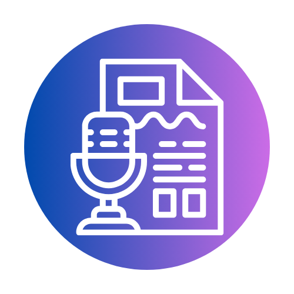

<p align="center">
  
</p>

<h1 align="center">La Mia Scribe</h1>

<p align="center">
  <strong>Local AI Transcription & Caption Studio</strong><br>
  by <a href="https://github.com/Tech-Inclusion-Pro">Tech Inclusion Pro</a> (Dr. Rocco G. Catrone, CPACC)
</p>

<p align="center">
  
  
  
  
  
</p>

---

**La Mia Scribe** is a privacy-first, fully accessible desktop application for transcribing audio and video files using AI. All processing runs locally on your machine — no data ever leaves your computer.

Built with PyQt6, powered by [faster-whisper](https://github.com/SYSTRAN/faster-whisper) for transcription and [Ollama](https://ollama.ai) for optional AI post-processing.

---

## Features

### Transcription
- **Local AI Transcription** — Powered by faster-whisper (CTranslate2) with 6 model sizes from tiny to large-v3
- **23-Language Support** — Transcribe audio in any of 23 languages or use auto-detect
- **YouTube Support** — Paste a YouTube URL to download and transcribe videos directly
- **Real-Time Progress** — Live progress bar, step-by-step status updates, and detailed processing log

### AI Post-Processing (via Ollama)
- **Filler Word Cleanup** — Remove "um", "uh", "like", "you know"
- **Summary Generation** — AI-generated summary and key points
- **Spanish Translation** — Translate transcripts to Spanish
- **Speaker Labeling** — Identify and label different speakers

### Export
- **5 Export Formats** — SRT, VTT, TXT, PDF, DOCX
- **Branded Output** — Professional PDF and DOCX with Tech Inclusion Pro branding
- **Bilingual Export** — Export in English, Spanish, or both
- **Clipboard Copy** — One-click copy to clipboard

### Dashboard & Project History
- **Project Dashboard** — View all past transcription projects with metadata
- **Open Saved Transcripts** — Reload and re-export any previous transcription
- **Project Notes** — Add personal notes to any project
- **Project Management** — Delete projects you no longer need

### Accessibility (WCAG 2.1 AA Compliant)
- **8 Color Themes** — Light, Dark, Forest, High Contrast, and 4 colorblind-safe themes (Protanopia, Deuteranopia, Tritanopia, Achromatopsia)
- **5 Font Sizes** — Small, Default, Large, XL, XXL
- **3 Font Types** — Default, OpenDyslexic (dyslexia-friendly), Bionic Reading (ADHD-friendly)
- **4 Cursor Styles** — Default, Large, Crosshair, Trail
- **Reduced Motion** — Disable animations
- **Enhanced Text Spacing** — Improved readability
- **Enhanced Focus Indicators** — Visible focus outlines for keyboard navigation
- **Full Keyboard Navigation** — Tab/Shift+Tab through all controls
- **Screen Reader Compatible** — Works with VoiceOver (macOS), NVDA, JAWS

### Internationalization (i18n)
- **23 Languages** — English, Chinese, Hindi, Spanish, French, Arabic, Bengali, Portuguese, Russian, Urdu, Indonesian, German, Japanese, Nigerian Pidgin, Egyptian Arabic, Marathi, Telugu, Turkish, Tamil, Cantonese, Vietnamese, Tagalog, Italian
- **RTL Support** — Full right-to-left layout for Arabic, Urdu, and Egyptian Arabic
- **Live Language Switching** — Change the app language instantly without restarting

### Additional Features
- **User Accounts** — Sign in / Create account with save login option
- **Interactive Tutorial** — 11-step walkthrough to learn the app
- **Drag & Drop** — Drop media files directly onto the app
- **Find & Replace** — Search and replace text in transcripts
- **Editable Transcripts** — Click and edit any part of the transcript

---

## Download & Install

### Option 1: macOS App (Recommended for macOS)

Download the latest `.app` bundle from the [Releases](https://github.com/Tech-Inclusion-Pro/LaMiaScibe/releases) page and drag it to your Applications folder.

### Option 2: Run from Source (All Platforms)

#### Prerequisites

- **Python 3.10+** — [Download Python](https://www.python.org/downloads/)
- **FFmpeg** — Required for audio extraction
  - macOS: `brew install ffmpeg`
  - Windows: `choco install ffmpeg` or [download from ffmpeg.org](https://ffmpeg.org/download.html)
  - Linux: `sudo apt install ffmpeg`
- **Ollama** (optional) — For AI post-processing: [ollama.ai](https://ollama.ai)

#### Steps

```bash
# Clone the repository
git clone https://github.com/Tech-Inclusion-Pro/LaMiaScibe.git
cd LaMiaScibe

# Install dependencies
pip install -r requirements.txt

# Run the app
python main.py
```

---

## How to Use

### 1. Sign In
When the app launches, sign in or create a new account. Check "Save login info" to auto-login next time.

### 2. Load a Media File
On the left panel:
- **Drag & drop** a file onto the drop zone, or
- Click **Browse File** to select from your computer, or
- Paste a **YouTube URL** and click **Fetch**

Supported formats: MP4, MOV, AVI, MKV, MP3, WAV, M4A, OGG

### 3. Configure Settings
- **Model Size** — `tiny` (fastest) to `large-v3` (most accurate). `medium` is recommended.
- **Language** — Select the audio language or leave on Auto-detect
- **Device** — `auto` (recommended), `cpu`, or `cuda` (GPU)
- **Compute Type** — `int8` (fastest), `float16`, `float32`

### 4. Enable AI Post-Processing (Optional)
If Ollama is running, check any combination of:
- Clean up filler words
- Generate summary & key points
- Translate to Spanish
- Label speakers

### 5. Transcribe
Click **Transcribe** (or press `Ctrl+T`). Watch the progress bar and log as the app:
1. Extracts audio from your media file
2. Loads the Whisper model
3. Transcribes with real-time progress
4. Runs Ollama post-processing (if enabled)

### 6. Review & Edit
The transcript appears with timestamps and speaker labels. You can:
- Click to edit any text
- Press `Ctrl+F` for Find & Replace
- Toggle between English and Spanish (if translated)

### 7. Export
Select your formats (SRT, VTT, TXT, PDF, DOCX), choose a save location, and click **Save**. Or click **Copy** to copy to clipboard.

### 8. Dashboard
Click **Dashboard** to view all your past projects, reopen saved transcripts, add notes, or delete old projects.

---

## Ollama Setup (Optional)

Ollama enables AI-powered post-processing features. It's completely optional — transcription works without it.

1. Install Ollama: [ollama.ai](https://ollama.ai)
2. Pull a model: `ollama pull llama3`
3. Start the server: `ollama serve`
4. The app auto-detects Ollama and lists available models

---

## Keyboard Shortcuts

| Shortcut | Action |
|----------|--------|
| `Ctrl+T` | Start transcription |
| `Ctrl+S` | Save / Export |
| `Ctrl+F` | Find & Replace in transcript |
| `Escape` | Close dialogs and panels |
| `Tab` / `Shift+Tab` | Navigate between controls |

---

## Accessibility

La Mia Scribe is built from the ground up to meet **WCAG 2.1 Level AA** standards:

- All interactive elements are keyboard accessible
- Color contrast ratios meet or exceed 4.5:1
- All touch targets are at least 44x44px
- Screen reader announcements for all state changes
- No information conveyed by color alone
- Focus management for dialogs and panels
- Labels properly associated with inputs

Open the **Accessibility Panel** (floating button, bottom-right) to customize the app to your needs.

---

## Supported Languages

| Language | Code | Language | Code |
|----------|------|----------|------|
| English | `en` | Japanese | `ja` |
| Chinese | `zh` | Nigerian Pidgin | `pcm` |
| Hindi | `hi` | Egyptian Arabic | `arz` |
| Spanish | `es` | Marathi | `mr` |
| French | `fr` | Telugu | `te` |
| Arabic | `ar` | Turkish | `tr` |
| Bengali | `bn` | Tamil | `ta` |
| Portuguese | `pt` | Cantonese | `yue` |
| Russian | `ru` | Vietnamese | `vi` |
| Urdu | `ur` | Tagalog | `tl` |
| Indonesian | `id` | Italian | `it` |
| German | `de` | | |

---

## Project Structure

```
la-mia-scribe/
├── main.py                  # Application entry point
├── launch_wrapper.py        # macOS .app wrapper
├── launcher.c               # Native macOS launcher binary source
├── requirements.txt         # Python dependencies
├── app/                     # PyQt6 UI widgets
│   ├── main_window.py       # Main application window
│   ├── left_panel.py        # File input & Whisper settings
│   ├── transcript_viewer.py # Editable transcript display
│   ├── export_panel.py      # Export format selection
│   ├── progress_widget.py   # Progress bar & log
│   ├── dashboard_widget.py  # Project history dashboard
│   ├── login_window.py      # Login/register forms
│   ├── tutorial_dialog.py   # Interactive tutorial
│   ├── accessibility_panel.py # WCAG accessibility settings
│   ├── theme_manager.py     # Dynamic QSS theme generation
│   └── settings_dialog.py   # QSettings management
├── core/                    # Backend logic
│   ├── audio_extractor.py   # FFmpeg audio extraction
│   ├── transcriber.py       # faster-whisper transcription
│   ├── ollama_processor.py  # Ollama AI post-processing
│   ├── youtube_handler.py   # YouTube download via yt-dlp
│   ├── user_db.py           # User authentication
│   ├── project_store.py     # Project history storage
│   ├── models.py            # Data models
│   ├── i18n.py              # Internationalization engine
│   └── translations.py      # 23-language translation strings
├── exporters/               # Export format modules
│   ├── srt_exporter.py
│   ├── vtt_exporter.py
│   ├── txt_exporter.py
│   ├── pdf_exporter.py
│   └── docx_exporter.py
├── utils/                   # Shared utilities
│   ├── time_utils.py
│   └── thread_workers.py
└── assets/                  # Icons, fonts, styles
    ├── logo.png
    ├── AppIcon.icns
    ├── OpenDyslexic-Regular.otf
    ├── OpenDyslexic-Bold.otf
    └── styles.qss
```

---

## Tech Stack

- **Python 3.10+** — Core language
- **PyQt6** — Desktop UI framework
- **faster-whisper** — Local AI transcription (CTranslate2)
- **Ollama** — Local LLM post-processing
- **yt-dlp** — YouTube audio download
- **FFmpeg** — Audio extraction
- **ReportLab** — PDF generation
- **python-docx** — DOCX generation

---

## License

This project is licensed under the MIT License — see the [LICENSE](LICENSE) file for details.

---

<p align="center">
  Made with care by <a href="https://github.com/Tech-Inclusion-Pro">Tech Inclusion Pro</a><br>
  <em>Technology for everyone.</em>
</p>
